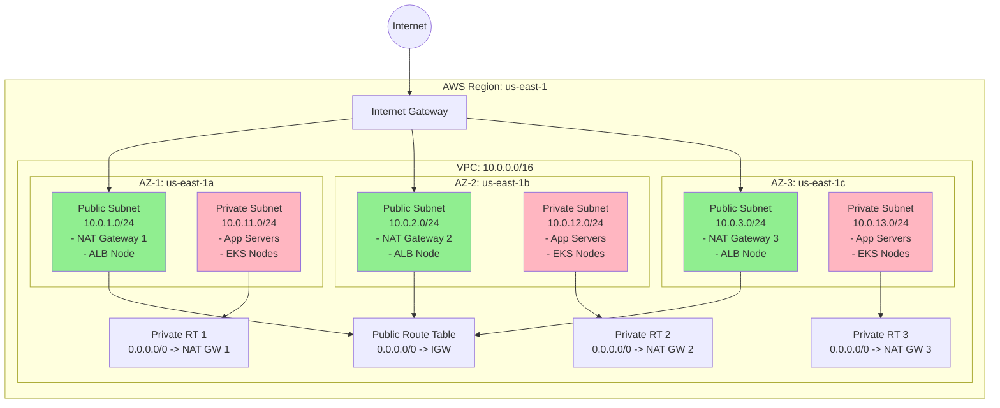

# ADR-0001: Networking Stack — VPC Multi-AZ com Subnets Publicas e Privadas

## Status
Approved

## Data
2026-05-23

## Contexto

O projeto necessita de uma infraestrutura de rede base na AWS para suportar workloads de producao. A rede deve fornecer isolamento entre camadas publicas (load balancers, bastion hosts) e privadas (aplicacoes, bancos de dados), seguindo o padrao de referencia da AWS para VPCs production-ready.

A stack de networking existente (commit `fee3f2b`) foi removida (arquivos deletados no working tree) e precisa ser redesenhada seguindo as melhores praticas do AWS Well-Architected Framework. Este ADR estabelece a arquitetura de referencia e serve como guia de implementacao para o DevOps Engineer Agent.

Todas as opcoes consideradas utilizam **exclusivamente recursos nativos do provider `hashicorp/aws`** (versao 6.46.0, validada via Terraform Registry em 2026-05-23). Nenhum modulo comunitario ou de terceiros e utilizado, eliminando riscos de supply chain e dependencias externas.

### Premissas (a serem validadas com o time)

Como nao foram fornecidos requisitos detalhados de SLA, compliance ou budget, este ADR assume:

- **Regiao**: us-east-1 (a confirmar com o time)
- **Ambiente**: Producao (com possibilidade de replicar para staging/dev)
- **SLA alvo**: 99.9% (alta disponibilidade via multi-AZ, sem multi-regiao)
- **Compliance**: Sem requisitos regulatorios especificos declarados (LGPD, PCI-DSS, HIPAA)
- **Budget**: Otimizado para custo, sem Savings Plans ou Reserved Instances para componentes de rede
- **IaC**: Terraform (ja em uso no repositorio)
- **Restricao de IaC**: Apenas recursos nativos do provider `hashicorp/aws` — sem modulos comunitarios ou de terceiros

## Drivers da Decisao

- **Isolamento de rede**: Workloads sensiveis (aplicacoes, dados) devem residir em subnets privadas sem acesso direto da internet
- **Alta disponibilidade**: Distribuicao de recursos em multiplas Availability Zones para resiliencia a falhas de AZ
- **Acesso a internet controlado**: Subnets privadas precisam de acesso outbound (atualizacoes, APIs externas) via NAT Gateway
- **Observabilidade de rede**: VPC Flow Logs para auditoria e troubleshooting
- **Fundacao para workloads futuros**: A VPC deve suportar EKS, RDS, ALB e outros servicos que exigem subnets dedicadas
- **Padronizacao via IaC**: Infraestrutura reproduzivel e versionada com Terraform
- **Zero dependencias externas**: Uso exclusivo de recursos nativos do provider AWS para eliminar riscos de supply chain

## Opcoes Consideradas

### Opcao A: Recursos nativos com NAT Gateway por AZ (alta disponibilidade)

Implementacao usando recursos individuais do provider `hashicorp/aws` v6.46.0 com um NAT Gateway dedicado em cada Availability Zone, garantindo isolamento total de falhas entre AZs.

**Recursos Terraform necessarios (todos validados no provider hashicorp/aws v6.46.0):**
- `aws_vpc` (providerDocID: 12311652)
- `aws_subnet` (providerDocID: 12311612)
- `aws_internet_gateway` (providerDocID: 12310904)
- `aws_eip` (providerDocID: 12310718) — um por AZ para NAT Gateways
- `aws_nat_gateway` (providerDocID: 12311085) — um por AZ
- `aws_route_table` (providerDocID: 12311351) — 1 publica + 1 por AZ privada
- `aws_route` (providerDocID: 12311310)
- `aws_route_table_association` (providerDocID: 12311352)
- `aws_flow_log` (providerDocID: 12310776)
- `aws_cloudwatch_log_group` (CloudWatch provider resource)
- `aws_iam_role` + `aws_iam_role_policy` (IAM provider resources para Flow Logs)

**Pros:**
- Controle granular sobre cada recurso e sua configuracao
- Sem dependencia de modulos de terceiros — zero risco de supply chain
- Alta disponibilidade: falha de NAT Gateway em uma AZ nao afeta outras AZs
- Facilita aprendizado e entendimento da equipe sobre os componentes de rede AWS
- Flexibilidade total para customizacoes especificas do projeto
- Codigo auditavel linha a linha
- Route tables independentes por AZ privada isolam falhas de roteamento

**Contras:**
- Maior volume de codigo Terraform (~200-300 linhas)
- Custo mais alto: 3 NAT Gateways + 3 EIPs (~$109.50/mes fixo)
- Necessidade de implementar logica de CIDR calculation manualmente
- Maior superficie de erro humano na configuracao de route tables e associacoes

**Custo estimado mensal (infra):** ~$109.50/mes (3 NAT GW + 3 EIP, sem data processing)
**Custo estimado de implementacao:** 4-6 horas de engenharia

---

### Opcao B: Recursos nativos com single NAT Gateway (custo otimizado)

Mesma abordagem de recursos nativos do provider `hashicorp/aws` v6.46.0, porem utilizando um unico NAT Gateway compartilhado entre todas as AZs. Todas as route tables privadas apontam para o mesmo NAT Gateway em uma unica AZ.

**Recursos Terraform necessarios (identicos a Opcao A, com quantidades reduzidas):**
- `aws_vpc` (providerDocID: 12311652)
- `aws_subnet` (providerDocID: 12311612)
- `aws_internet_gateway` (providerDocID: 12310904)
- `aws_eip` (providerDocID: 12310718) — apenas 1
- `aws_nat_gateway` (providerDocID: 12311085) — apenas 1
- `aws_route_table` (providerDocID: 12311351) — 1 publica + 1 privada compartilhada
- `aws_route` (providerDocID: 12311310)
- `aws_route_table_association` (providerDocID: 12311352)
- `aws_flow_log` (providerDocID: 12310776)
- `aws_cloudwatch_log_group` (CloudWatch provider resource)
- `aws_iam_role` + `aws_iam_role_policy` (IAM provider resources para Flow Logs)

**Pros:**
- Custo significativamente menor: 1 NAT Gateway + 1 EIP (~$36.50/mes fixo)
- Menor volume de codigo Terraform (~150-200 linhas)
- Menos recursos para gerenciar e monitorar
- Mesma abordagem de recursos nativos — zero risco de supply chain
- Adequado para ambientes de dev/staging

**Contras:**
- Single point of failure: se o NAT Gateway falhar, todas as subnets privadas perdem acesso outbound
- Trafego cross-AZ: subnets privadas em AZs diferentes do NAT Gateway incorrem em custos de transferencia cross-AZ ($0.01/GB em cada direcao)
- Nao atende SLA de 99.9% para acesso outbound de subnets privadas
- Bottleneck potencial: todo trafego outbound de todas as AZs passa por um unico NAT Gateway

**Custo estimado mensal (infra):** ~$36.50/mes (1 NAT GW + 1 EIP, sem data processing) + custos de transferencia cross-AZ
**Custo estimado de implementacao:** 3-4 horas de engenharia

## Decisao

**Opcao A: Recursos nativos com NAT Gateway por AZ (alta disponibilidade).**

Esta e a abordagem recomendada para o ambiente de producao. A Opcao B (single NAT Gateway) permanece documentada como alternativa valida para ambientes de dev/staging onde o trade-off de disponibilidade e aceitavel em troca de economia de custo.

### Justificativa pelos 6 pilares do Well-Architected Framework

| Pilar | Justificativa | Trade-off |
|-------|---------------|-----------|
| **Operational Excellence** | Recursos nativos facilitam debugging e entendimento do estado real da infra. Cada recurso tem lifecycle independente no Terraform state, simplificando operacoes day-2 como substituicao de NAT Gateway ou resize de subnets. Sem abstracoes de modulos externos que possam obscurecer o estado real. | Mais codigo para manter, mas codigo explicito e auditavel. |
| **Security** | Controle granular sobre Security Groups, NACLs e VPC Flow Logs. Zero codigo de terceiros no pipeline — elimina risco de supply chain. Least privilege aplicado por design: subnets privadas sem rotas diretas para internet, NAT Gateways apenas para outbound. Todo codigo e auditavel linha a linha. | Necessidade de implementar security controls manualmente em vez de depender de defaults de modulos. |
| **Reliability** | Multi-AZ com 3 Availability Zones. Um NAT Gateway por AZ elimina single point of failure. Route tables independentes por AZ privada isolam falhas de roteamento. DNS hostnames e resolution habilitados para service discovery. Alinhado com o padrao de referencia da AWS (documentacao oficial valida deploy de NAT Gateway por AZ). | NAT Gateway por AZ aumenta custo vs single NAT Gateway. |
| **Performance Efficiency** | CIDR /24 por subnet (251 IPs disponiveis) oferece espaco adequado para crescimento. Subnets dimensionadas para suportar EKS (requer IPs para pods), RDS, ALB. VPC CIDR /16 permite expansao futura com subnets adicionais. Trafego permanece intra-AZ (sem custos de cross-AZ para acesso outbound). | CIDR pode ser superdimensionado para workloads pequenos, mas o custo de IP allocation e zero. |
| **Cost Optimization** | NAT Gateway por AZ (~$32.85/mes cada x 3 = ~$98.55/mes) mais EIPs (~$3.65 cada x 3 = ~$10.95/mes). Trade-off aceito para garantir alta disponibilidade. Para ambientes de dev/staging, aplicar Opcao B (single NAT Gateway) reduz para ~$36.50/mes. | NAT Gateways sao o principal driver de custo. |
| **Sustainability** | Recursos criados apenas quando necessarios. NAT Gateways sao managed services — AWS otimiza o hardware subjacente. VPC Flow Logs com retencao configuravel para evitar storage desnecessario. Trafego intra-AZ evita hops desnecessarios. | Sem otimizacoes adicionais de sustentabilidade nesta camada. |

## Consequencias

### Positivas
- Fundacao de rede solida para todos os workloads futuros (EKS, RDS, ALB, Lambda em VPC)
- Isolamento claro entre camadas publica e privada
- Alta disponibilidade nativa via distribuicao em 3 AZs com NAT Gateway por AZ
- VPC Flow Logs habilitados desde o dia zero para auditoria
- Codigo Terraform explicito que serve como documentacao viva da rede
- Zero dependencias externas — todo codigo usa exclusivamente recursos nativos do provider hashicorp/aws
- Facilita onboarding de novos engenheiros no projeto

### Negativas / Trade-offs aceitos
- Custo de ~$109.50/mes em NAT Gateways + EIPs (3x AZs) — aceitavel para producao
- Mais codigo Terraform para manter (~200-300 linhas) vs abordagens com modulos
- CIDR planning manual requer atencao para evitar sobreposicoes em expansoes futuras

### Riscos e mitigacoes
| Risco | Probabilidade | Impacto | Mitigacao |
|-------|--------------|---------|-----------|
| Sobreposicao de CIDR com VPCs futuras | Baixa | Alto | Documentar CIDR allocation plan. Reservar ranges para futuras VPCs. |
| Exaustao de IPs em subnets /24 | Baixa | Medio | Monitorar uso de IPs via CloudWatch. CIDR /16 permite criar subnets adicionais. |
| Falha de NAT Gateway em uma AZ | Muito baixa (managed service) | Baixo (isolado por AZ) | Um NAT Gateway por AZ garante que falha e isolada. AWS SLA de 99.9% no servico. |
| Drift de configuracao manual | Media | Medio | Terraform state como source of truth. CI/CD com `terraform plan` em PRs. |
| Erro humano em route table associations | Media | Alto | Code review obrigatorio. Validacoes pos-deploy automatizadas. Testes com `terraform plan` antes de apply. |

## Diagrama



## Implementation Guidelines (para o DevOps Engineer Agent)

### IaC Stack
- **Terraform** com provider `hashicorp/aws` versao **6.46.0** (validado via Terraform Registry em 2026-05-23)
- **Terraform version**: >= 1.0 (compatibilidade do provider)
- **Backend**: configurar remote state (S3 + DynamoDB para locking) — se ainda nao existente
- **Restricao**: usar **exclusivamente recursos nativos** do provider `hashicorp/aws` — nenhum modulo externo permitido

### Recursos nativos do provider hashicorp/aws a serem utilizados

Todos os recursos abaixo foram validados como disponiveis no provider `hashicorp/aws` v6.46.0 via Terraform MCP Server:

| Recurso Terraform | Provider Doc ID | Finalidade |
|-------------------|-----------------|------------|
| `aws_vpc` | 12311652 | VPC principal com CIDR 10.0.0.0/16 |
| `aws_subnet` | 12311612 | Subnets publicas e privadas (6 total, 2 por AZ) |
| `aws_internet_gateway` | 12310904 | Internet Gateway para subnets publicas |
| `aws_eip` | 12310718 | Elastic IPs para NAT Gateways (3 total) |
| `aws_nat_gateway` | 12311085 | NAT Gateways para acesso outbound das subnets privadas (3 total) |
| `aws_route_table` | 12311351 | Route tables (1 publica + 3 privadas) |
| `aws_route` | 12311310 | Rotas individuais (IGW para publica, NAT GW para privadas) |
| `aws_route_table_association` | 12311352 | Associacao de subnets a route tables |
| `aws_flow_log` | 12310776 | VPC Flow Logs para auditoria de trafego |
| `aws_cloudwatch_log_group` | - | Log group para destino dos Flow Logs |
| `aws_iam_role` | - | IAM Role para VPC Flow Logs |
| `aws_iam_role_policy` | - | Policy inline para permissoes de Flow Logs |

### Arquivos Terraform a serem criados

O engenheiro deve criar os seguintes arquivos no diretorio `01-networking-stack/`:

| Arquivo | Conteudo |
|---------|----------|
| `versions.tf` | Bloco `terraform {}` com `required_version`, `required_providers` (hashicorp/aws ~> 6.46), backend config |
| `variables.tf` | Variaveis: `aws_region`, `vpc_cidr`, `environment`, `project_name`, `public_subnet_cidrs`, `private_subnet_cidrs`, `availability_zones`, `enable_flow_logs`, `flow_log_retention_days` |
| `main.tf` | Provider AWS config, data source `aws_availability_zones` |
| `vpc.tf` | Recursos: `aws_vpc`, `aws_internet_gateway`, habilitacao de DNS hostnames/support |
| `subnets.tf` | Recursos: `aws_subnet` (public e private, iterando por AZ com `count` ou `for_each`) |
| `nat-gateway.tf` | Recursos: `aws_eip`, `aws_nat_gateway` (um por AZ) |
| `route-tables.tf` | Recursos: `aws_route_table` (1 publica + 1 por AZ privada), `aws_route`, `aws_route_table_association` |
| `flow-logs.tf` | Recursos: `aws_flow_log`, `aws_cloudwatch_log_group`, `aws_iam_role`, `aws_iam_role_policy` |
| `outputs.tf` | Outputs: `vpc_id`, `vpc_cidr`, `public_subnet_ids`, `private_subnet_ids`, `nat_gateway_ids`, `internet_gateway_id`, `public_route_table_id`, `private_route_table_ids` |
| `tags.tf` | Local values com tags padrao (`Environment`, `Project`, `ManagedBy = "terraform"`, `Stack = "networking"`) |
| `terraform.tfvars` | Valores default para o ambiente alvo (sem secrets) |

### Ordem de execucao e dependencias

```
1. versions.tf      -> Provider e backend (sem dependencias)
2. variables.tf     -> Declaracao de variaveis (sem dependencias)
3. tags.tf          -> Local values (sem dependencias)
4. main.tf          -> Provider config (depende de variables)
5. vpc.tf           -> aws_vpc + aws_internet_gateway (depende de provider)
6. subnets.tf       -> aws_subnet (depende de aws_vpc)
7. nat-gateway.tf   -> aws_eip + aws_nat_gateway (depende de aws_subnet publicas)
8. route-tables.tf  -> aws_route_table + aws_route + aws_route_table_association (depende de aws_internet_gateway, aws_nat_gateway, aws_subnet)
9. flow-logs.tf     -> aws_flow_log + aws_cloudwatch_log_group + aws_iam_role + aws_iam_role_policy (depende de aws_vpc)
10. outputs.tf      -> Outputs (depende de todos os recursos)
```

**Nota:** O Terraform resolve dependencias automaticamente via referencias. A ordem acima e logica/conceitual para orientar o engenheiro na escrita.

### Variaveis e secrets necessarios
- `aws_region` — regiao AWS (default: `us-east-1`)
- `vpc_cidr` — CIDR block da VPC (default: `10.0.0.0/16`)
- `environment` — nome do ambiente (ex: `production`, `staging`)
- `project_name` — prefixo para naming de recursos
- `public_subnet_cidrs` — lista de CIDRs para subnets publicas (default: `["10.0.1.0/24", "10.0.2.0/24", "10.0.3.0/24"]`)
- `private_subnet_cidrs` — lista de CIDRs para subnets privadas (default: `["10.0.11.0/24", "10.0.12.0/24", "10.0.13.0/24"]`)
- `availability_zones` — lista de AZs (default: `["us-east-1a", "us-east-1b", "us-east-1c"]`)
- **Sem secrets necessarios para esta stack**

### Validacoes pos-deploy
1. `terraform plan` mostra 0 changes (state consistente)
2. `aws ec2 describe-vpcs --filters "Name=tag:Name,Values=<vpc_name>"` retorna VPC com DNS habilitado
3. `aws ec2 describe-subnets --filters "Name=vpc-id,Values=<vpc_id>"` retorna 6 subnets (3 public + 3 private)
4. `aws ec2 describe-nat-gateways --filter "Name=vpc-id,Values=<vpc_id>"` retorna 3 NAT Gateways com status `available`
5. `aws ec2 describe-route-tables --filters "Name=vpc-id,Values=<vpc_id>"` retorna 4 route tables (1 public + 3 private)
6. `aws ec2 describe-flow-logs --filter "Name=resource-id,Values=<vpc_id>"` retorna flow log ativo
7. Teste de conectividade: instancia em subnet privada consegue acessar internet outbound via NAT Gateway

### Rollback strategy
1. `terraform destroy` remove todos os recursos criados (lifecycle limpo, sem dependencias externas no dia zero)
2. Em caso de falha parcial: `terraform plan` identifica drift e `terraform apply` corrige
3. State file deve estar em backend remoto com versionamento habilitado para point-in-time recovery

## Observabilidade e Day-2

### Metricas-chave
- **NAT Gateway**: `BytesOutToDestination`, `BytesOutToSource`, `PacketsDropCount`, `ErrorPortAllocation`, `ActiveConnectionCount`
- **VPC**: Numero de IPs disponiveis por subnet (`AvailableIPAddressCount` via CloudWatch ou AWS Config)
- **Flow Logs**: Volume de logs ingerido, rejected packets count

### Alarmes recomendados
| Alarme | Metrica | Threshold | Acao |
|--------|---------|-----------|------|
| NAT GW Error Port Allocation | `ErrorPortAllocation > 0` | 1 por 5 min | Notificacao SNS — indica exaustao de portas |
| NAT GW Packets Dropped | `PacketsDropCount > 100` | 100 por 5 min | Investigar trafego anomalo |
| Subnet IP Exhaustion | `AvailableIPAddressCount < 50` | 50 IPs | Planejar expansao de subnets |

### Dashboards
- Dashboard CloudWatch com metricas de NAT Gateway por AZ
- Painel de VPC Flow Logs via CloudWatch Logs Insights (top talkers, rejected connections, cross-AZ traffic)

### Runbooks necessarios
- **RB-NET-001**: Substituicao de NAT Gateway com falha (drenar conexoes, recriar via Terraform)
- **RB-NET-002**: Expansao de CIDR — adicionar subnets secundarias quando IPs se aproximam de exaustao
- **RB-NET-003**: Investigacao de trafego suspeito via VPC Flow Logs (queries CloudWatch Logs Insights)

### Backup e DR
- Terraform state versionado no S3 com lifecycle policy
- CIDR allocation plan documentado para evitar conflitos em DR cross-region
- Para DR multi-regiao: replicar esta stack via Terraform em regiao secundaria (fora do escopo deste ADR)

## Seguranca

### IAM (principio do least privilege)
- IAM Role para VPC Flow Logs com permissoes restritas a `logs:CreateLogStream`, `logs:PutLogEvents`, `logs:DescribeLogStreams` no log group especifico
- Terraform execution role deve ter permissoes minimas para criar recursos VPC (`ec2:CreateVpc`, `ec2:CreateSubnet`, etc.) — documentar policy no repositorio
- Nenhuma IAM role para workloads nesta stack (responsabilidade das stacks de aplicacao)

### Criptografia
- **At-rest**: VPC Flow Logs no CloudWatch Logs podem ser criptografados com KMS (recomendado para producao — avaliar custo do KMS key)
- **In-transit**: Todo trafego entre AZs dentro da VPC e criptografado automaticamente pela AWS (desde 2023)
- **NAT Gateway**: Trafego outbound preserva criptografia TLS das aplicacoes end-to-end

### Network segmentation
- **VPC**: CIDR `10.0.0.0/16` — isolamento de rede completo
- **Public subnets** (`10.0.1.0/24`, `10.0.2.0/24`, `10.0.3.0/24`): Auto-assign public IP habilitado, rota para Internet Gateway
- **Private subnets** (`10.0.11.0/24`, `10.0.12.0/24`, `10.0.13.0/24`): Sem acesso direto da internet, rota outbound via NAT Gateway
- **Security Groups**: Nao criados nesta stack — cada workload stack (EKS, RDS, ALB) deve criar seus proprios SGs com regras especificas
- **NACLs**: Usar default NACLs (allow all) nesta fase. Endurecer via NACLs customizadas quando requisitos de compliance forem definidos

### Logging e auditoria
- **VPC Flow Logs**: Habilitados para todo trafego (ACCEPT + REJECT) com retencao de 90 dias no CloudWatch Logs
- **CloudTrail**: Deve estar habilitado na conta (fora do escopo desta stack) para auditoria de API calls de criacao/modificacao de recursos VPC
- **AWS Config**: Recomendado habilitar regras de conformidade para VPC (ex: `vpc-flow-logs-enabled`, `vpc-default-security-group-closed`) — fora do escopo desta stack

## Custo Estimado

### Mensal aproximado (regiao us-east-1)

| Recurso | Quantidade | Custo unitario | Custo mensal |
|---------|-----------|---------------|-------------|
| NAT Gateway (por hora) | 3 | $0.045/hr x 730hr | $98.55 |
| NAT Gateway (data processing) | variavel | $0.045/GB | Depende do trafego outbound |
| Elastic IP (associado) | 3 | $0.005/hr x 730hr | $10.95 |
| VPC | 1 | Gratuito | $0.00 |
| Subnets | 6 | Gratuito | $0.00 |
| Internet Gateway | 1 | Gratuito | $0.00 |
| Route Tables | 4 | Gratuito | $0.00 |
| VPC Flow Logs (ingestao CloudWatch) | variavel | $0.50/GB | Depende do volume de trafego |
| CloudWatch Logs (storage) | variavel | $0.03/GB/mes | Depende da retencao |
| **Total fixo (sem data processing)** | | | **~$109.50/mes** |

**Nota sobre Elastic IPs**: Desde fevereiro de 2024, AWS cobra $0.005/hr por endereco IPv4 publico, inclusive quando associado a recursos em execucao.

**Comparativo com Opcao B (single NAT Gateway):** ~$36.50/mes fixo — economia de ~$73/mes, recomendado apenas para ambientes nao-prod.

### Principais drivers de custo
1. **NAT Gateways** (~90% do custo fixo): $98.55/mes para 3 NAT Gateways
2. **Elastic IPs**: $10.95/mes para 3 EIPs
3. **Data processing**: Variavel — $0.045/GB pelo NAT Gateway + custos de VPC Flow Logs

### Oportunidades de otimizacao futura
- **Ambientes nao-prod**: Aplicar Opcao B deste ADR — single NAT Gateway (economia de ~$73/mes) aceitando o trade-off de single point of failure
- **VPC Endpoints**: Adicionar Gateway Endpoints para S3 e DynamoDB (gratuitos) para reduzir trafego via NAT Gateway — usar recursos nativos `aws_vpc_endpoint` (providerDocID: 12311658)
- **Flow Logs para S3**: Migrar destino de Flow Logs para S3 em vez de CloudWatch Logs (mais barato para alto volume)
- **NAT Instance**: Para ambientes de dev com trafego minimo, considerar NAT Instance (t3.nano ~$3.80/mes) em vez de NAT Gateway (~$32.85/mes) — trade-off de disponibilidade e throughput

## Referencias

- AWS Well-Architected Framework — Reliability Pillar: [https://docs.aws.amazon.com/wellarchitected/latest/reliability-pillar/welcome.html](https://docs.aws.amazon.com/wellarchitected/latest/reliability-pillar/welcome.html)
- AWS VPC Best Practices — Private subnets and NAT gateways: [https://docs.aws.amazon.com/vpc/latest/userguide/create-a-vpc-with-private-subnets-and-nat-gateways-using-aws-cli.html](https://docs.aws.amazon.com/vpc/latest/userguide/create-a-vpc-with-private-subnets-and-nat-gateways-using-aws-cli.html)
- Terraform AWS Provider v6.46.0: [https://registry.terraform.io/providers/hashicorp/aws/6.46.0](https://registry.terraform.io/providers/hashicorp/aws/6.46.0)
- Terraform AWS Provider — aws_vpc resource: [https://registry.terraform.io/providers/hashicorp/aws/latest/docs/resources/vpc](https://registry.terraform.io/providers/hashicorp/aws/latest/docs/resources/vpc)
- Terraform AWS Provider — aws_nat_gateway resource: [https://registry.terraform.io/providers/hashicorp/aws/latest/docs/resources/nat_gateway](https://registry.terraform.io/providers/hashicorp/aws/latest/docs/resources/nat_gateway)
- Terraform AWS Provider — aws_flow_log resource: [https://registry.terraform.io/providers/hashicorp/aws/latest/docs/resources/flow_log](https://registry.terraform.io/providers/hashicorp/aws/latest/docs/resources/flow_log)
- AWS VPC Pricing: [https://aws.amazon.com/vpc/pricing/](https://aws.amazon.com/vpc/pricing/)
- AWS NAT Gateway Pricing: [https://aws.amazon.com/vpc/pricing/#NATGateway](https://aws.amazon.com/vpc/pricing/#NATGateway)
- ADRs relacionados: Nenhum (este e o primeiro ADR do projeto)
