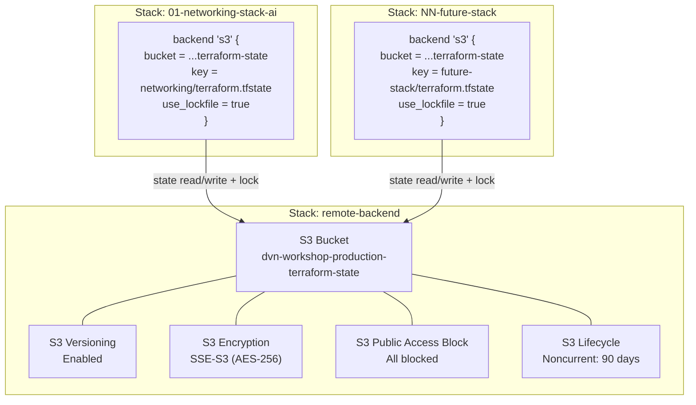

# ADR-0002: Remote Backend — S3 com Native Locking para Terraform State

## Status
Approved

## Data
2026-05-23

## Contexto

O repositorio `dvn-workshop-maio` e um workshop AWS com multiplas stacks Terraform independentes, prefixadas com dois digitos (ex: `01-networking-stack-ai`). Atualmente, o state de cada stack e armazenado localmente (`terraform.tfstate`), o que apresenta riscos de perda de dados, impossibilita colaboracao em equipe e nao oferece mecanismos de locking para prevenir modificacoes concorrentes.

E necessario criar uma stack `remote-backend` (sem prefixo numerico, excluida de operacoes bulk conforme `CLAUDE.md`) que provisione a infraestrutura para armazenamento remoto de state files. Apos provisionada, as demais stacks (como `01-networking-stack-ai`) devem ser migradas para utilizar esse backend.

### Contexto tecnico do projeto

- **Provider**: `hashicorp/aws ~> 6.0` (versao mais recente: 6.46.0, validada via Terraform Registry em 2026-05-23)
- **Terraform**: `>= 1.10.0`
- **Regiao**: `us-east-1`
- **Projeto**: `dvn-workshop`, ambiente `production`
- **Naming**: projeto segue convencao `dvn-workshop-production` para nomes de recursos
- **IaC**: exclusivamente recursos nativos do provider `hashicorp/aws`, sem modulos comunitarios

### Descoberta importante sobre state locking

A documentacao prescritiva da AWS (validada em 2026-05-23) indica que o **S3 native state locking** (via `use_lockfile = true`) esta disponivel desde Terraform 1.10.0 e e a abordagem recomendada. O DynamoDB-based locking e considerado **deprecated** e sera removido em versoes futuras do Terraform. Como o projeto ja utiliza Terraform >= 1.10.0, ambas as opcoes sao viaveis, e essa escolha e analisada detalhadamente abaixo.

## Drivers da Decisao

- Prevenir perda acidental de state files (atualmente armazenados localmente)
- Habilitar colaboracao entre multiplos operadores no workshop
- Garantir locking para prevenir corrupcao de state por operacoes concorrentes
- Manter consistencia com as convencoes de nomenclatura e estrutura do projeto
- Alinhar com as melhores praticas do AWS Well-Architected Framework
- Preparar a base para futuras stacks no repositorio

## Opcoes Consideradas

### Opcao A: S3 + DynamoDB (locking legado)

Provisionar um bucket S3 para armazenamento de state files e uma tabela DynamoDB com partition key `LockID` para state locking, seguindo o padrao classico documentado pela AWS e HashiCorp.

**Recursos Terraform necessarios (validados via Terraform Registry, provider hashicorp/aws 6.46.0):**
- `aws_s3_bucket` (ID: 12311357)
- `aws_s3_bucket_versioning` (ID: 12311378)
- `aws_s3_bucket_server_side_encryption_configuration` (ID: 12311377)
- `aws_s3_bucket_lifecycle_configuration` (ID: 12311365)
- `aws_s3_bucket_public_access_block` (ID: 12311374)
- `aws_dynamodb_table` (ID: 12310622)

- **Pros**:
  - Padrao amplamente documentado e adotado pela comunidade
  - Compativel com todas as versoes do Terraform (inclusive < 1.10.0)
  - Locking explicito via DynamoDB com visibilidade sobre quem detem o lock
  - Permite audit trail via CloudTrail tanto para S3 quanto DynamoDB
- **Contras**:
  - DynamoDB locking e **deprecated** na documentacao oficial da AWS e da HashiCorp
  - Custo adicional (ainda que minimo) da tabela DynamoDB
  - Recurso adicional para gerenciar e monitorar
  - Sera removido em versoes futuras do Terraform, exigindo migracao
- **Custo estimado**:
  - S3: ~USD 0.023/GB/mes (Standard), praticamente zero para state files (< 1MB total)
  - DynamoDB: PAY_PER_REQUEST — custo negligivel para operacoes de lock (< USD 0.01/mes)
  - **Total: < USD 1.00/mes**

### Opcao B: S3 com native locking (sem DynamoDB)

Provisionar apenas o bucket S3 com `use_lockfile = true` no bloco backend, utilizando o locking nativo do S3 introduzido no Terraform 1.10.0. Nao requer tabela DynamoDB.

**Recursos Terraform necessarios:**
- `aws_s3_bucket` (ID: 12311357)
- `aws_s3_bucket_versioning` (ID: 12311378)
- `aws_s3_bucket_server_side_encryption_configuration` (ID: 12311377)
- `aws_s3_bucket_lifecycle_configuration` (ID: 12311365)
- `aws_s3_bucket_public_access_block` (ID: 12311374)

- **Pros**:
  - Abordagem **recomendada** pela AWS Prescriptive Guidance (2026)
  - Menor complexidade operacional — um recurso a menos para gerenciar
  - Menor custo (elimina DynamoDB)
  - Alinhado com a direcao futura do Terraform
  - Locking nativo do S3 usa conditional writes, sem dependencias externas
- **Contras**:
  - Requer Terraform >= 1.10.0 (ja atendido pelo projeto)
  - Menos documentacao e exemplos na comunidade comparado ao padrao classico
  - Menor visibilidade sobre estado do lock (sem item em tabela DynamoDB para inspecionar)
  - Participantes do workshop podem encontrar tutoriais online baseados no padrao DynamoDB, gerando confusao
- **Custo estimado**:
  - S3: ~USD 0.023/GB/mes (Standard), praticamente zero para state files
  - **Total: < USD 0.50/mes**

### Analise: SSE-S3 vs SSE-KMS para criptografia

| Criterio | SSE-S3 (AES-256) | SSE-KMS (aws/s3 ou CMK) |
|---|---|---|
| Custo | Incluido, sem custo adicional | USD 1.00/mes por chave + USD 0.03/10.000 requests |
| Complexidade | Zero configuracao adicional | Requer gerenciamento de key policy |
| Auditoria | Sem log de uso da chave | CloudTrail registra cada uso da chave |
| Controle de acesso | Via IAM/bucket policy | Granular via key policy + IAM |
| Rotacao de chave | Automatica, gerenciada pela AWS | Configuravel (automatica ou manual) |
| Compliance | Suficiente para maioria dos cenarios | Necessario para HIPAA, PCI-DSS, FedRAMP |

**Recomendacao**: SSE-S3 (AES-256) para este workshop. Nao ha requisitos de compliance declarados que justifiquem o custo e complexidade adicionais do KMS. Se requisitos de compliance surgirem, a migracao para SSE-KMS e nao-disruptiva.

### Analise: Com vs sem replica cross-region

| Criterio | Sem replica | Com replica cross-region |
|---|---|---|
| Custo | Base | +100% armazenamento + transfer |
| Complexidade | Minima | Requer bucket destino + replication rules |
| DR | Versionamento protege contra corrupcao | Protege contra indisponibilidade regional |
| Latencia | N/A | Replica assincrona (minutos) |

**Recomendacao**: Sem replica cross-region para este workshop. O versionamento do S3 ja protege contra corrupcao acidental. Para um workshop, a indisponibilidade regional de us-east-1 e um risco aceitavel. Replicacao pode ser adicionada via `aws_s3_bucket_replication_configuration` (ID: 12311375) se necessario no futuro.

## Decisao

**Opcao B: S3 com native locking (`use_lockfile = true`)** — com SSE-S3 e sem replica cross-region.

### Justificativa

A Opcao B e escolhida por ser a abordagem recomendada pela AWS Prescriptive Guidance para projetos com Terraform >= 1.10.0, eliminando a necessidade de gerenciar uma tabela DynamoDB separada:

1. **Alinhamento com recomendacoes atuais**: S3 native locking via `use_lockfile = true` e a abordagem recomendada pela AWS (2026). Adotar o padrao recomendado desde o inicio evita divida tecnica e migracao futura.

2. **Menor complexidade operacional**: Um recurso a menos para provisionar, monitorar e gerenciar. O locking nativo do S3 usa conditional writes sem dependencias externas.

3. **Menor custo**: Elimina o custo (ainda que minimo) da tabela DynamoDB e suas operacoes.

4. **Valor pedagogico atualizado**: O workshop deve ensinar as melhores praticas vigentes, nao padroes deprecated. Participantes aprendem a abordagem que efetivamente usarao em projetos reais.

### Avaliacao contra os 6 pilares do Well-Architected Framework

| Pilar | Avaliacao |
|---|---|
| **Operational Excellence** | Automacao via IaC (Terraform). State centralizado habilita CI/CD. S3 native locking (`use_lockfile = true`) previne conflitos operacionais sem dependencias externas. Outputs estruturados permitem referencia por outras stacks. |
| **Security** | Block public access em todas as 4 dimensoes. SSE-S3 para criptografia at-rest. Bucket policy restritiva (deny insecure transport). IAM least privilege para acesso ao state. Lock files armazenados no proprio bucket S3. |
| **Reliability** | S3 oferece 99.999999999% durabilidade e 99.99% disponibilidade. Versionamento habilita rollback de state corrompido. Locking nativo usa conditional writes do S3 com alta disponibilidade. Lifecycle policy remove versoes antigas apos 90 dias para evitar acumulo. |
| **Performance Efficiency** | S3 Standard e adequado para o padrao de acesso (baixa frequencia, baixo volume). Locking nativo sem servico adicional, sem latencia extra. Nenhum recurso superdimensionado. |
| **Cost Optimization** | Custo total < USD 0.50/mes. Sem DynamoDB, sem custo adicional de locking. Lifecycle policy reduz custo de armazenamento de versoes antigas. SSE-S3 sem custo adicional vs KMS. |
| **Sustainability** | Recurso serverless/managed (S3) com eficiencia energetica gerenciada pela AWS. Sem recursos ociosos — uso sob demanda. Lifecycle policy remove dados desnecessarios. Menos recursos provisionados comparado a Opcao A. |

## Consequencias

### Positivas
- State files protegidos contra perda (durabilidade 11 noves do S3)
- Colaboracao habilitada entre participantes do workshop
- Locking previne corrupcao por operacoes concorrentes
- Versionamento permite rollback em caso de state corrompido
- Estrutura de keys organizada por stack facilita gestao
- Custo praticamente zero

### Negativas / Trade-offs aceitos
- Menor visibilidade sobre estado do lock comparado ao DynamoDB (sem item em tabela para inspecionar diretamente)
- Menos documentacao e exemplos na comunidade comparado ao padrao classico S3 + DynamoDB
- Participantes do workshop podem encontrar tutoriais online baseados no padrao DynamoDB, gerando divergencia com o material do workshop
- State do proprio remote-backend e local (chicken-and-egg problem) — aceito como padrao da industria
- SSE-S3 nao oferece auditoria granular de uso de chave (aceitavel sem requisitos de compliance)

### Riscos e mitigacoes
| Risco | Probabilidade | Impacto | Mitigacao |
|---|---|---|---|
| Exclusao acidental do bucket | Baixa | Alto | Versionamento habilitado + lifecycle policy com noncurrent versions |
| Corrupcao de state | Baixa | Alto | Versionamento permite restaurar versao anterior |
| Perda do state local do remote-backend | Media | Medio | Documentar procedimento de import dos recursos existentes |
| Confusao de participantes com tutoriais baseados em DynamoDB | Media | Baixo | Documentar explicitamente no material do workshop a diferenca entre os padroes e o motivo da escolha |

## Diagrama



### Estrutura de keys no S3

```
dvn-workshop-production-terraform-state/
  networking/terraform.tfstate        # 01-networking-stack-ai
  compute/terraform.tfstate           # 02-compute-stack (futuro)
  database/terraform.tfstate          # 03-database-stack (futuro)
  ...
```

A convencao e usar o **nome semantico da stack** (sem o prefixo numerico) como diretorio, seguido de `terraform.tfstate`.

## Implementation Guidelines (para o DevOps Engineer Agent)

### IaC stack
- **Provider**: `hashicorp/aws ~> 6.0` (versao atual: 6.46.0, validada via Terraform Registry)
- **Terraform**: `>= 1.10.0`
- **Diretorio**: `remote-backend/` (raiz do repositorio, sem prefixo numerico)

### Recursos necessarios (todos validados no provider hashicorp/aws 6.46.0)

| Recurso Terraform | Provider Doc ID | Arquivo sugerido |
|---|---|---|
| `aws_s3_bucket` | 12311357 | `s3.tf` |
| `aws_s3_bucket_versioning` | 12311378 | `s3.versioning.tf` |
| `aws_s3_bucket_server_side_encryption_configuration` | 12311377 | `s3.encryption.tf` |
| `aws_s3_bucket_lifecycle_configuration` | 12311365 | `s3.lifecycle.tf` |
| `aws_s3_bucket_public_access_block` | 12311374 | `s3.public-access.tf` |

### Estrutura de arquivos esperada

```
remote-backend/
  versions.tf                  # terraform {}, required_version, required_providers
  main.tf                      # provider config
  variables.tf                 # variaveis agrupadas (sem default)
  outputs.tf                   # outputs para referencia por outras stacks
  tags.tf                      # locals com common_tags
  s3.tf                        # aws_s3_bucket
  s3.versioning.tf             # aws_s3_bucket_versioning
  s3.encryption.tf             # aws_s3_bucket_server_side_encryption_configuration
  s3.lifecycle.tf              # aws_s3_bucket_lifecycle_configuration
  s3.public-access.tf          # aws_s3_bucket_public_access_block
  envs/
    production.tfvars          # valores para ambiente production
```

### Variaveis esperadas

```hcl
# variables.tf — apenas declaracao, sem default
variable "aws_region" { type = string, description = "Regiao AWS" }

variable "project" {
  type = object({
    name        = string
    environment = string
  })
}

variable "backend" {
  type = object({
    bucket_name                        = string
    noncurrent_version_expiration_days = number
  })
}
```

### Valores esperados (production.tfvars)

```hcl
aws_region = "us-east-1"

project = {
  name        = "dvn-workshop"
  environment = "production"
}

backend = {
  bucket_name                        = "dvn-workshop-production-terraform-state"
  noncurrent_version_expiration_days = 90
}
```

### Detalhes de configuracao dos recursos

**S3 Bucket (`s3.tf`)**:
- `bucket` = `var.backend.bucket_name`
- Tags incluindo `common_tags`

**S3 Versioning (`s3.versioning.tf`)**:
- `versioning_configuration.status = "Enabled"`

**S3 Encryption (`s3.encryption.tf`)**:
- `rule.apply_server_side_encryption_by_default.sse_algorithm = "AES256"`
- `rule.bucket_key_enabled = true`

**S3 Lifecycle (`s3.lifecycle.tf`)**:
- Rule para noncurrent versions: `noncurrent_version_expiration.noncurrent_days = var.backend.noncurrent_version_expiration_days`
- `filter {}` vazio para aplicar a todos os objetos

**S3 Public Access Block (`s3.public-access.tf`)**:
- `block_public_acls = true`
- `block_public_policy = true`
- `ignore_public_acls = true`
- `restrict_public_buckets = true`

### Outputs necessarios

```hcl
output "s3_bucket_id" { description = "ID do bucket S3 para terraform state" }
output "s3_bucket_arn" { description = "ARN do bucket S3" }
```

### Ordem de execucao
1. `terraform init` (backend local para esta stack)
2. `terraform plan -var-file="envs/production.tfvars"`
3. `terraform apply -var-file="envs/production.tfvars"`
4. Verificar outputs
5. Configurar backend block em `01-networking-stack-ai` e executar `terraform init -migrate-state`

### Configuracao do backend nas stacks consumidoras

Apos o deploy do `remote-backend`, cada stack deve adicionar ao seu `versions.tf`:

```hcl
terraform {
  backend "s3" {
    bucket       = "dvn-workshop-production-terraform-state"
    key          = "networking/terraform.tfstate"  # ajustar por stack
    region       = "us-east-1"
    use_lockfile = true
    encrypt      = true
  }
}
```

### Rollback strategy
- O state do `remote-backend` e local (deliberadamente). Em caso de falha no apply, o rollback e automatico pelo Terraform.
- Se o bucket precisar ser destruido e recriado, todas as stacks consumidoras devem ter seus states exportados previamente (`terraform state pull > backup.tfstate`).

## Observabilidade e Day-2

### Metricas-chave
- S3: `NumberOfObjects`, `BucketSizeBytes` (via S3 Storage Metrics)

### Alarmes recomendados
- Nao necessarios para o workshop. Em producao real, considerar alarme para `4xxErrors` no bucket (tentativas de acesso negado) e `DeleteObject` events via CloudTrail.

### Dashboards
- Nao necessarios para o workshop. O estado pode ser verificado via AWS Console ou `aws s3 ls`.

### Runbooks necessarios
- **Restaurar state de versao anterior**: `aws s3api list-object-versions` + `aws s3api get-object --version-id`
- **Forcar unlock de state travado**: `terraform force-unlock <LOCK_ID>` (usar com cautela)

### Backup e DR
- Versionamento do S3 serve como backup primario
- Para DR adicional, considerar habilitar AWS Backup para o bucket (nao implementado neste ADR)
- State do `remote-backend` (local) deve ser versionado no git ou armazenado em local seguro

## Seguranca

### IAM (principio do least privilege)
- Neste workshop, o operador usa credenciais administrativas para simplificar
- Em producao, criar IAM policy especifica com permissoes minimas:
  - S3: `s3:GetObject`, `s3:PutObject`, `s3:DeleteObject`, `s3:ListBucket` — limitado ao bucket do state
- Considerar SCP para prevenir exclusao acidental do bucket

### Criptografia
- **At-rest**: SSE-S3 (AES-256) — criptografia gerenciada pela AWS, sem custo adicional
- **In-transit**: TLS enforced via bucket policy (deny `aws:SecureTransport = false`)
- **Bucket key**: habilitado para reduzir chamadas ao servico de criptografia

### Network segmentation
- S3 e um servico gerenciado com endpoint publico
- Para o workshop, acesso via internet e aceitavel
- Em producao, considerar VPC Gateway endpoint para S3 para eliminar trafego pela internet

### Logging e auditoria
- CloudTrail captura automaticamente chamadas de API ao S3 (ja habilitado por padrao na conta)
- S3 server access logging nao habilitado neste ADR (custo desnecessario para workshop)
- Em producao, habilitar `aws_s3_bucket_logging` para audit trail granular

## Custo Estimado

### Mensal aproximado
| Recurso | Custo estimado |
|---|---|
| S3 Standard (< 1MB state files) | < USD 0.01 |
| S3 Requests (PUT/GET, incluindo lock files) | < USD 0.01 |
| **Total** | **< USD 0.50/mes** |

### Principais drivers de custo
- Armazenamento de versoes antigas no S3 (mitigado pela lifecycle policy de 90 dias)

### Oportunidades de otimizacao futura
- Reduzir `noncurrent_version_expiration_days` de 90 para 30 dias se rollback historico nao for necessario
- Considerar S3 Intelligent-Tiering se o bucket crescer significativamente (improvavel para state files)

## Referencias

- [AWS Prescriptive Guidance — Backend best practices](https://docs.aws.amazon.com/prescriptive-guidance/latest/terraform-aws-provider-best-practices/backend.html)
- [AWS DevOps Blog — Best practices for managing Terraform State files](https://aws.amazon.com/blogs/devops/best-practices-for-managing-terraform-state-files-in-aws-ci-cd-pipeline/)
- [AWS Well-Architected Framework — Security Pillar](https://docs.aws.amazon.com/wellarchitected/latest/security-pillar/welcome.html)
- [Terraform S3 Backend Documentation](https://developer.hashicorp.com/terraform/language/settings/backends/s3)
- [Terraform Provider hashicorp/aws 6.46.0](https://registry.terraform.io/providers/hashicorp/aws/6.46.0)
- ADR relacionado: [ADR-0001 — Networking Stack VPC Multi-AZ](ADR-0001-networking-stack-vpc-multi-az.md)
