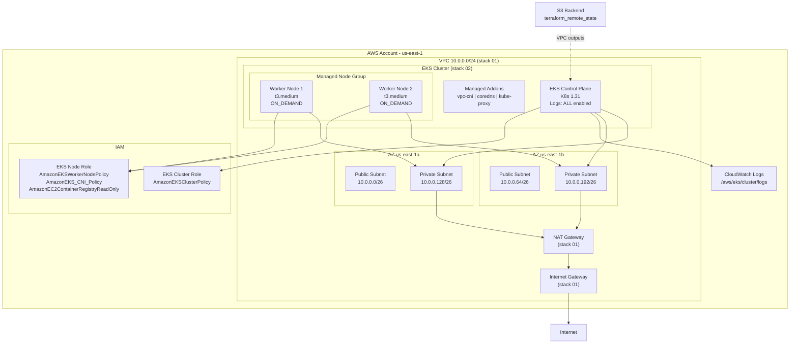

# ADR-0003: EKS Cluster com Managed Node Group para Workloads de Container

## Status
Approved

## Data
2026-05-24

## Contexto

O projeto `dvn-workshop` ja possui uma stack de networking (`01-networking-stack-ai`) com VPC, subnets publicas/privadas, NAT Gateway e route tables provisionadas na regiao `us-east-1`. O proximo passo natural e provisionar um cluster Kubernetes gerenciado (EKS) para executar workloads containerizados.

O cluster deve ser simples, com 2 worker nodes de capacidade ON_DEMAND, logs do control plane habilitados para todos os tipos, e seguir as boas praticas do AWS Well-Architected Framework. A stack deve reutilizar a infraestrutura de rede existente via `terraform_remote_state`.

### Constraints levantados no discovery

- **Regiao**: `us-east-1` (mesma da stack de networking)
- **Provider**: exclusivamente `hashicorp/aws` -- sem modulos comunitarios
- **IaC**: Terraform >= 1.10.0, provider `hashicorp/aws ~> 6.0` (versao mais recente disponivel: **6.46.0**, validada via Terraform MCP Server)
- **Backend**: S3 bucket `dvn-workshop-production-terraform-state` com lock file e encriptacao
- **VPC existente**: CIDR `10.0.0.0/24`, 2 AZs (`us-east-1a`, `us-east-1b`), subnets privadas `10.0.0.128/26` e `10.0.0.192/26`
- **Convencoes**: nomenclatura do projeto conforme `.claude/rules/terraform-naming-conventions.md`, variaveis como objetos agrupados sem `default`

## Drivers da Decisao

- Necessidade de uma plataforma de orquestracao de containers gerenciada para rodar workloads
- Requisito de observabilidade completa do control plane desde o dia zero
- Simplicidade operacional: cluster gerenciado com managed node groups, sem self-managed nodes
- Reutilizacao da infraestrutura de rede ja provisionada e validada
- Aderencia ao Well-Architected Framework em todos os pilares

## Opcoes Consideradas

### Opcao A: EKS com Managed Node Group (Recomendada)

- **Descricao**: Cluster EKS padrao com managed node group usando instancias EC2 ON_DEMAND. Nodes provisionados nas subnets privadas da VPC existente. Addons gerenciados pela AWS (vpc-cni, coredns, kube-proxy).
- **Pros**:
  - Lifecycle gerenciado pela AWS (AMI updates, draining automatico)
  - Auto Scaling Group gerenciado automaticamente pelo EKS
  - Addons managed simplificam upgrades e patches
  - Menor overhead operacional para o time
  - Integra nativamente com IAM, CloudWatch, VPC
- **Contras**:
  - Menor flexibilidade de customizacao de AMI vs self-managed
  - Custo do control plane EKS ($0.10/hora = ~$73/mes)
- **Custo estimado mensal**:
  - Control plane: ~$73
  - 2x t3.medium ON_DEMAND (us-east-1): ~$61 (2 x $0.0416/h x 730h)
  - NAT Gateway (ja existente): custo compartilhado com stack 01
  - CloudWatch Logs (control plane): ~$5-10 dependendo do volume
  - **Total estimado: ~$139-144/mes**

### Opcao B: EKS com Auto Mode

- **Descricao**: Cluster EKS com Auto Mode habilitado, onde o EKS gerencia automaticamente compute, networking e storage.
- **Pros**:
  - Zero gerenciamento de node groups
  - Scaling automatico e inteligente
  - Menor complexidade operacional
- **Contras**:
  - Menor controle sobre tipos de instancia e sizing
  - Requer `bootstrap_self_managed_addons = false`
  - Requer policies adicionais (EKSComputePolicy, EKSBlockStoragePolicy, EKSLoadBalancingPolicy, EKSNetworkingPolicy)
  - Nao atende ao requisito explicito de "2 nodes t3.medium ON_DEMAND"
  - Mais complexo de prever custos
- **Custo estimado mensal**: Variavel, depende do workload. Potencialmente mais caro sem controle fino.

### Opcao C: ECS Fargate (alternativa sem Kubernetes)

- **Descricao**: Usar ECS com Fargate ao inves de EKS, eliminando o gerenciamento de nodes.
- **Pros**:
  - Sem custo de control plane
  - Serverless -- sem gerenciamento de instancias
  - Pricing por vCPU/memoria consumida
- **Contras**:
  - Nao atende ao requisito explicito de cluster EKS
  - Vendor lock-in mais forte
  - Sem portabilidade Kubernetes
  - Limitacoes de networking e storage vs EKS
- **Custo estimado mensal**: ~$50-80 para workloads equivalentes (2 vCPU, 4GB RAM)

## Decisao

**Opcao A: EKS com Managed Node Group** e a escolhida.

### Justificativa contra os 6 pilares do Well-Architected

| Pilar | Como esta decisao o atende |
|---|---|
| **Operational Excellence** | Managed node group simplifica operacoes day-2 (AMI updates automaticos, draining). Logs do control plane habilitados desde o dia zero para todos os tipos (api, audit, authenticator, controllerManager, scheduler). Addons managed garantem patches automaticos. |
| **Security** | Nodes em subnets privadas, sem exposicao direta a internet. IAM roles separadas para cluster e nodes com least privilege. Endpoint do API server publico (para acesso kubectl) com opcao de restringir via CIDR. Security groups com regras minimas. |
| **Reliability** | Nodes distribuidos em 2 AZs (us-east-1a, us-east-1b). Scaling config com min=2, max=4 para absorver falhas. Update config com max_unavailable=1 para rolling updates seguros. Addons managed garantem compatibilidade de versoes. |
| **Performance Efficiency** | t3.medium (2 vCPU, 4GB RAM) e adequado para workloads de workshop. Capacidade ON_DEMAND garante disponibilidade imediata. vpc-cni addon garante networking nativo da VPC para pods. |
| **Cost Optimization** | ON_DEMAND e adequado para workloads de workshop sem previsibilidade de uso. t3.medium oferece boa relacao custo/beneficio. Sem over-provisioning: 2 nodes iniciais com auto-scaling ate 4. Total estimado ~$140/mes. |
| **Sustainability** | Instancias t3 sao burst-capable, usando creditos de CPU de forma eficiente. Scaling ate max=4 apenas sob demanda, evitando recursos ociosos. |

### Trade-offs aceitos

- **Endpoint publico**: o API server tera endpoint publico habilitado para facilitar acesso kubectl. Em producao real, recomenda-se restringir via `public_access_cidrs` ou desabilitar e usar apenas endpoint privado com VPN/bastion.
- **Sem encryption de secrets com KMS**: para simplicidade do workshop, secrets do Kubernetes nao serao encriptados com CMK customizada. O EKS ja encripta etcd at-rest por padrao.
- **Sem IRSA (IAM Roles for Service Accounts)**: o OIDC provider nao sera configurado nesta iteracao. Pode ser adicionado em ADR futuro.

## Consequencias

### Positivas
- Cluster EKS funcional e operacional em ~15 minutos apos o apply
- Observabilidade do control plane desde o dia zero
- Base solida para deploy de workloads Kubernetes
- Infraestrutura como codigo versionada e reproduzivel

### Negativas / Trade-offs aceitos
- Custo fixo do control plane (~$73/mes) independente do uso
- Endpoint publico do API server (aceitavel para workshop)
- Sem IRSA configurado nesta iteracao

### Riscos e mitigacoes
| Risco | Probabilidade | Impacto | Mitigacao |
|---|---|---|---|
| Subnets privadas com CIDR pequeno (/26 = 62 IPs) podem limitar numero de pods | Media | Medio | vpc-cni usa IPs da subnet para pods. Com 2 nodes t3.medium, o limite e ~34 pods (17 ENIs x 2 nodes). Monitorar uso de IPs. |
| Upgrade de versao do EKS pode causar downtime | Baixa | Medio | Update config com max_unavailable=1 garante rolling update. Testar em staging antes. |
| Logs do control plane podem gerar custo inesperado | Baixa | Baixo | Monitorar volume de logs no CloudWatch. Configurar retention policy. |

## Diagrama



## Implementation Guidelines (para o DevOps Engineer Agent)

### IaC Stack

- **Terraform**: >= 1.10.0
- **Provider**: `hashicorp/aws ~> 6.0` (versao mais recente validada: 6.46.0)
- **Recursos nativos** -- sem modulos comunitarios

### Estrutura de arquivos

```
02-eks-stack-ai/
├── versions.tf                # terraform block, backend s3, required_providers
├── main.tf                    # provider aws, data terraform_remote_state
├── variables.tf               # variaveis agrupadas (eks, project, aws_region)
├── outputs.tf                 # outputs do cluster e node group
├── tags.tf                    # locals common_tags
├── eks.tf                     # aws_eks_cluster
├── eks.node-group.tf          # aws_eks_node_group
├── eks.iam.tf                 # IAM roles e policy attachments
├── eks.security-group.tf      # Security groups para cluster e nodes
├── eks.addons.tf              # aws_eks_addon (vpc-cni, coredns, kube-proxy)
└── envs/
    └── production.tfvars      # valores para ambiente production
```

### Recursos Terraform necessarios

| Arquivo | Recursos |
|---|---|
| `versions.tf` | `terraform {}` block com backend S3 key `eks/terraform.tfstate` |
| `main.tf` | `provider "aws"`, `data "terraform_remote_state" "networking"` apontando para `networking/terraform.tfstate` no mesmo bucket S3 |
| `eks.iam.tf` | `aws_iam_role.cluster` (assume role para `eks.amazonaws.com` com actions `sts:AssumeRole` e `sts:TagSession`), `aws_iam_role_policy_attachment.cluster_AmazonEKSClusterPolicy`, `aws_iam_role.node` (assume role para `ec2.amazonaws.com`), `aws_iam_role_policy_attachment.node_AmazonEKSWorkerNodePolicy`, `aws_iam_role_policy_attachment.node_AmazonEKS_CNI_Policy`, `aws_iam_role_policy_attachment.node_AmazonEC2ContainerRegistryReadOnly` |
| `eks.security-group.tf` | `aws_security_group.cluster` (SG adicional para o cluster, se necessario alem do managed SG) |
| `eks.tf` | `aws_eks_cluster.this` com `enabled_cluster_log_types = ["api", "audit", "authenticator", "controllerManager", "scheduler"]`, `vpc_config` usando `subnet_ids` das subnets privadas via remote state, `access_config` com `authentication_mode = "API_AND_CONFIG_MAP"`, `version = "1.31"`, `depends_on` nas policy attachments |
| `eks.node-group.tf` | `aws_eks_node_group.this` com `scaling_config { desired_size=2, min_size=2, max_size=4 }`, `instance_types = ["t3.medium"]`, `capacity_type = "ON_DEMAND"`, `ami_type = "AL2023_x86_64_STANDARD"`, `update_config { max_unavailable=1 }`, `subnet_ids` das subnets privadas, `depends_on` nas policy attachments do node role |
| `eks.addons.tf` | `aws_eks_addon.vpc_cni`, `aws_eks_addon.coredns`, `aws_eks_addon.kube_proxy` -- todos com `resolve_conflicts_on_create = "OVERWRITE"` e `depends_on` no node group (coredns precisa de nodes rodando) |
| `tags.tf` | `locals { common_tags = { Environment, Project, ManagedBy, Stack = "eks" } }` |

### Versao do Kubernetes

- **Recomendada: 1.31** -- versao estavel e amplamente adotada, com suporte standard ativo. A versao 1.35 ja esta disponivel no EKS (validada via AWS docs), porem 1.31 e a versao referenciada na documentacao oficial do provider Terraform `hashicorp/aws` 6.46.0 e oferece maior estabilidade para workshop.
- **Nota sobre `enabled_cluster_log_types`**: o valor correto do log type para controller manager no argumento Terraform e `"controllerManager"` (camelCase), conforme documentacao do provider. O usuario mencionou `"controllerPlane"` mas esse nao e um valor valido -- o correto e `"controllerManager"`.

### Variaveis Terraform (convencao de objetos agrupados, sem default)

```hcl
variable "aws_region" {
  description = "AWS region where all resources will be provisioned."
  type        = string
  nullable    = false
}

variable "project" {
  description = "Configuracoes do projeto."
  type = object({
    name        = string
    environment = string
  })
  nullable = false
}

variable "eks" {
  description = "Configuracoes do cluster EKS."
  type = object({
    cluster_name    = string
    cluster_version = string
    node_group = object({
      name           = string
      instance_types = list(string)
      capacity_type  = string
      ami_type       = string
      desired_size   = number
      min_size       = number
      max_size       = number
      disk_size      = number
    })
    cluster_log_types = list(string)
    endpoint_private_access = bool
    endpoint_public_access  = bool
  })
  nullable = false
}
```

### Valores em `envs/production.tfvars`

```hcl
aws_region = "us-east-1"

project = {
  name        = "dvn-workshop"
  environment = "production"
}

eks = {
  cluster_name    = "dvn-workshop-production"
  cluster_version = "1.31"
  node_group = {
    name           = "dvn-workshop-production-general"
    instance_types = ["t3.medium"]
    capacity_type  = "ON_DEMAND"
    ami_type       = "AL2023_x86_64_STANDARD"
    desired_size   = 2
    min_size       = 2
    max_size       = 4
    disk_size      = 20
  }
  cluster_log_types       = ["api", "audit", "authenticator", "controllerManager", "scheduler"]
  endpoint_private_access = true
  endpoint_public_access  = true
}
```

### Outputs esperados (convencao `{name}_{type}_{attribute}`)

```hcl
output "eks_cluster_name" {
  description = "The name of the EKS cluster."
}

output "eks_cluster_arn" {
  description = "The ARN of the EKS cluster."
}

output "eks_cluster_endpoint" {
  description = "The endpoint for the EKS cluster API server."
}

output "eks_cluster_certificate_authority_data" {
  description = "Base64 encoded certificate data for the EKS cluster."
}

output "eks_cluster_security_group_id" {
  description = "The ID of the EKS cluster security group created by EKS."
}

output "eks_cluster_version" {
  description = "The Kubernetes version of the EKS cluster."
}

output "eks_node_group_arn" {
  description = "The ARN of the EKS node group."
}

output "eks_node_group_status" {
  description = "The status of the EKS node group."
}

output "eks_cluster_iam_role_arn" {
  description = "The ARN of the IAM role used by the EKS cluster."
}

output "eks_node_iam_role_arn" {
  description = "The ARN of the IAM role used by the EKS node group."
}
```

### Ordem de execucao e dependencias

1. **IAM Roles e Policy Attachments** (`eks.iam.tf`) -- sem dependencias externas
2. **Security Groups** (`eks.security-group.tf`) -- depende do VPC ID via remote state
3. **EKS Cluster** (`eks.tf`) -- depende de IAM roles e subnets via remote state
4. **EKS Node Group** (`eks.node-group.tf`) -- depende do cluster e IAM roles de node
5. **EKS Addons** (`eks.addons.tf`) -- depende do cluster e node group (coredns precisa de nodes)

O Terraform resolve a maioria dessas dependencias automaticamente via referencias. Use `depends_on` explicitamente apenas para IAM policy attachments (conforme documentacao oficial do provider).

### Integracao com stack 01 via terraform_remote_state

```hcl
data "terraform_remote_state" "networking" {
  backend = "s3"
  config = {
    bucket = "dvn-workshop-production-terraform-state"
    key    = "networking/terraform.tfstate"
    region = "us-east-1"
  }
}
```

Outputs consumidos:
- `data.terraform_remote_state.networking.outputs.vpc_id`
- `data.terraform_remote_state.networking.outputs.private_subnet_ids`

### Variaveis e secrets necessarios

- Nenhuma secret necessaria para esta stack
- Credenciais AWS via profile ou environment variables (AWS_ACCESS_KEY_ID, AWS_SECRET_ACCESS_KEY, AWS_SESSION_TOKEN)

### Validacoes pos-deploy

1. `terraform output` -- verificar todos os outputs foram populados
2. `aws eks describe-cluster --name dvn-workshop-production --region us-east-1` -- verificar status `ACTIVE`
3. `aws eks describe-nodegroup --cluster-name dvn-workshop-production --nodegroup-name dvn-workshop-production-general --region us-east-1` -- verificar status `ACTIVE` e 2 nodes
4. `aws eks update-kubeconfig --name dvn-workshop-production --region us-east-1` -- configurar kubectl
5. `kubectl get nodes` -- verificar 2 nodes `Ready`
6. `kubectl get pods -n kube-system` -- verificar addons rodando (coredns, aws-node, kube-proxy)

### Rollback strategy

1. `terraform destroy -var-file="envs/production.tfvars"` -- remove toda a stack EKS
2. Ordem de destruicao e gerenciada automaticamente pelo Terraform (inverso da criacao)
3. O destroy remove: addons -> node group -> cluster -> security groups -> IAM roles
4. A stack 01 (networking) nao e afetada

## Observabilidade e Day-2

### Metricas-chave
- `node_cpu_utilization` -- utilizacao de CPU dos worker nodes
- `node_memory_utilization` -- utilizacao de memoria dos worker nodes
- `cluster_failed_node_count` -- nodes em estado de falha
- `pod_count` vs `pod_capacity` -- pressao de capacidade
- CloudWatch Logs volume para `/aws/eks/dvn-workshop-production/cluster`

### Alarmes recomendados
- Node count < 2 (node falhou e nao foi substituido)
- CPU utilization > 80% por 5 minutos
- Memory utilization > 80% por 5 minutos
- EKS cluster status != ACTIVE

### Dashboards
- CloudWatch Container Insights (pode ser habilitado como addon futuro)
- Dashboard customizado com metricas do node group

### Runbooks necessarios
- **Node nao-saudavel**: verificar EC2 status checks, EKS node group health, logs do kubelet
- **Addon degradado**: verificar `kubectl describe addon` e logs do pod no kube-system
- **Cluster unreachable**: verificar security groups, endpoint access, IAM permissions

### Backup e DR
- EKS control plane e gerenciado pela AWS (etcd backup automatico)
- Para workloads, recomenda-se Velero ou backup de manifests em Git (GitOps)
- Node group e stateless -- pode ser recriado a qualquer momento

## Seguranca

### IAM (principio do least privilege)

| Role | Trust Policy | Policies Attached |
|---|---|---|
| EKS Cluster Role | `eks.amazonaws.com` com `sts:AssumeRole` + `sts:TagSession` | `AmazonEKSClusterPolicy` |
| EKS Node Role | `ec2.amazonaws.com` com `sts:AssumeRole` | `AmazonEKSWorkerNodePolicy`, `AmazonEKS_CNI_Policy`, `AmazonEC2ContainerRegistryReadOnly` |

### Criptografia
- **At-rest**: etcd encriptado por padrao pelo EKS (AWS managed key). KMS CMK nao configurado nesta iteracao.
- **In-transit**: TLS entre control plane e worker nodes (gerenciado pelo EKS). Comunicacao kubectl via HTTPS.

### Network segmentation
- **Worker nodes**: subnets privadas apenas (sem IP publico)
- **Control plane**: endpoint publico + privado habilitados. O endpoint privado garante que a comunicacao nodes-to-control-plane permanece dentro da VPC.
- **Security Group do cluster (managed by EKS)**: regras automaticas para comunicacao control-plane-to-nodes
- **Security Group adicional (opcional)**: pode ser adicionado para restringir acesso adicional

### Logging e auditoria
- **EKS Control Plane Logs**: todos os 5 tipos habilitados, enviados para CloudWatch Logs group `/aws/eks/dvn-workshop-production/cluster`
- **CloudTrail**: chamadas de API do EKS sao registradas automaticamente (depende de configuracao da conta)
- **VPC Flow Logs**: ja habilitados na stack 01

## Custo Estimado

### Mensal aproximado (regiao us-east-1)

| Componente | Custo/mes |
|---|---|
| EKS Control Plane | ~$73.00 |
| 2x t3.medium ON_DEMAND (730h) | ~$60.74 |
| CloudWatch Logs (control plane, ~5GB) | ~$2.50 |
| CloudWatch Logs storage | ~$0.15 |
| **Total estimado** | **~$136-140/mes** |

### Principais drivers de custo
- Control plane EKS ($0.10/h) e o maior custo fixo
- Instancias EC2 t3.medium ($0.0416/h cada) sao o segundo maior custo
- Logs do control plane tem custo marginal

### Oportunidades de otimizacao futura
- **Savings Plans**: Compute Savings Plans podem reduzir custo das instancias em ate 30-40%
- **Graviton (t4g.medium)**: instancias ARM podem reduzir custo em ~20% com desempenho equivalente ou superior
- **Spot para workloads tolerantes**: adicionar um segundo node group com SPOT para workloads nao-criticos
- **Log retention**: configurar retention policy no CloudWatch para evitar acumulo de custos

## Referencias

- [AWS Well-Architected Framework - EKS Best Practices](https://aws.github.io/aws-eks-best-practices/)
- [Amazon EKS User Guide](https://docs.aws.amazon.com/eks/latest/userguide/)
- [Amazon EKS Platform Versions](https://docs.aws.amazon.com/eks/latest/userguide/platform-versions.html)
- [Terraform aws_eks_cluster Resource](https://registry.terraform.io/providers/hashicorp/aws/latest/docs/resources/eks_cluster)
- [Terraform aws_eks_node_group Resource](https://registry.terraform.io/providers/hashicorp/aws/latest/docs/resources/eks_node_group)
- [Terraform aws_eks_addon Resource](https://registry.terraform.io/providers/hashicorp/aws/latest/docs/resources/eks_addon)
- [hashicorp/aws Provider v6.46.0](https://registry.terraform.io/providers/hashicorp/aws/6.46.0)
- ADR-0001: Networking Stack VPC Multi-AZ
- ADR-0002: Remote Backend
